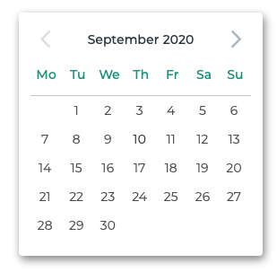
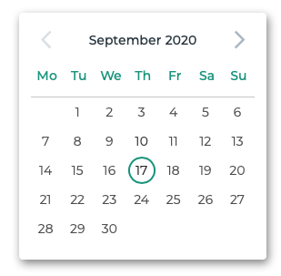
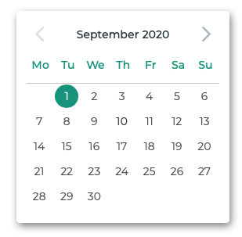

#Simply minimalistic skin for datepicker calendar.

##States

+ Normal



+ Hover on day



+ Day selected



##Possibilities for customize

You have possibility to change text color, background color and highlight colors. For this go to `less` directory and change variables:

```less
@background: #FFFFFF;
@font: #303C47;
@highlight: #339D85;
```

After this run:

```bash
lessc less/datepicker-skin.less dist/datepicker-skin.css
```
